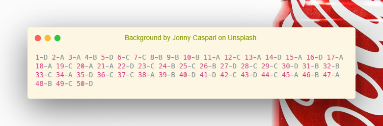
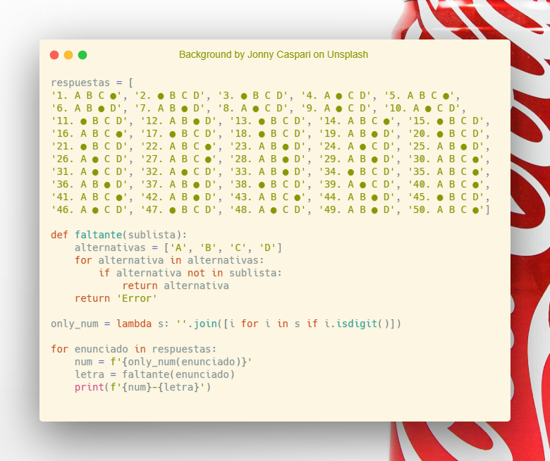

# Respuestas de alternativas

## ¿Qué es esto?
Script de Python3 que entrega el número y letra ennegrecida de una lista con cadenas de texto.

## ¿Cómo sé cual es la letra ennegrecida?
En este caso ficticio se utilizó el caracter con un punto negro. **'●'**

## ¿Qué uso puede tener ese script?
El script se puede usar para optimizar el tiempo de lectura de una hoja de respuestas.

## ¿Qué valores contiene la lista?
La lista contiene cadenas de texto obtenida de una hoja de respuestas ficticia.

## ¿Cómo puedo usar el código?
Simplemente modifica la lista, para evitar ingresar las cadenas de texto una a una se recomienda usar la función **Split** con el parámetro **'\n'**.

## Capturas de pantalla / Pantallazos.

## Recursos
- [Foto del fondo](https://unsplash.com/photos/g1vbQXOy0cI) en Splash hecha por Johhny Caspari.
- Imagen del código hecha con [Carbon](https://carbon.now.sh/)